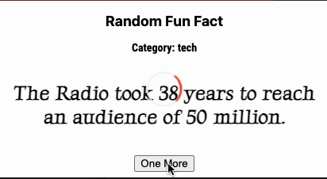

# Fun Facts Chrome Extension

## Demo

## Acknowledgement

- [Fun Facts API](https://asli-fun-fact-api.herokuapp.com/)

- [Video tutorial I followed](https://youtu.be/3Xq_QfYdmMQ)

- [CSS loading animation source](https://codepen.io/wang0nya/pen/bzwQPr)

- [Logo by flaticon](https://www.flaticon.com/premium-icon/fun_3248542?term=fun&related_id=3248542)
